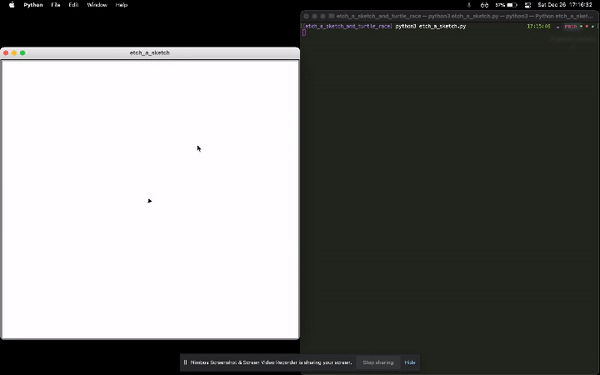
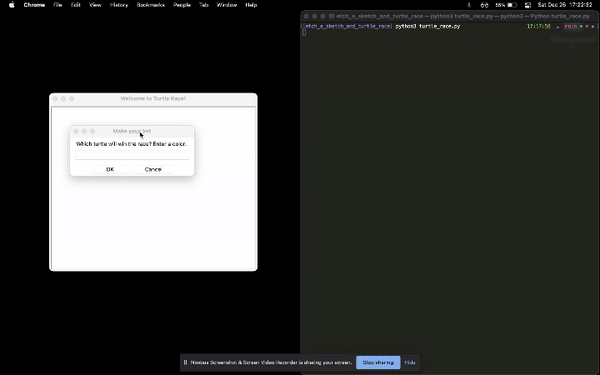

# etch_a_sketch_and_turtle_race

In terminal run python etch_a_sketch.py\
Etch-a-sketch - keyboard commans
- w = go forwards
- s = go backwards
- a = turn counter-clockwise
- d = turn clockwise 
- c = clear drawing

In terminal run python turtle_race.py
